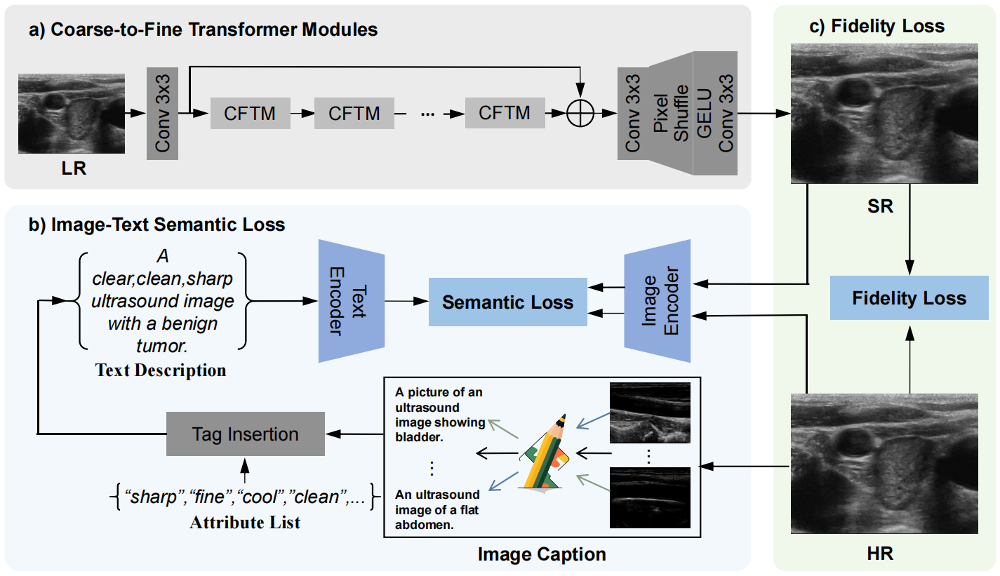

## M2Trans: Multi-Modal Regularized Course-to-Fine Transformer for Ultrasound Image Super-Resolution

#### IEEE Journal of Biomedical and Health Informatics (J-BHI)

[Zhangkai Ni](https://eezkni.github.io/)<sup>1</sup>, [Runyu Xiao](https://github.com/Xiao-R-Y)<sup>1</sup>, [Wenhan Yang](https://flyywh.github.io/)<sup>2</sup>, Hanli Wang<sup>1</sup>, Zhihua Wang<sup>3</sup>, Lihua Xiang<sup>4</sup>, Liping Sun<sup>4</sup> <br>
##### [[Paper](https://ieeexplore.ieee.org/document/10663841)] <!-- Should be added later -->

<sup>1</sup>Tongji University, <sup>2</sup>Pengcheng Laboratory, <sup>3</sup>Shenzhen MSU-BIT University, <sup>4</sup>Shanghai Tenth Peoples Hospital

This repository provides the official PyTorch implementation for the paper "M2Trans: Multi-Modal Regularized Course-to-Fine Transformer for Ultrasound Image Super-Resolution", IEEE Journal of Biomedical and Health Informatics (J-BHI), Early Access, August 2024.  <!-- Should be changed later -->





## Abstract
Ultrasound image super-resolution (SR) aims to transform low-resolution images into high-resolution ones, thereby restoring intricate details crucial for improved diagnostic accuracy. However, prevailing methods relying solely on image modality guidance and pixel-wise loss functions struggle to capture the distinct characteristics of medical images, such as unique texture patterns and specific colors harboring critical diagnostic information. To overcome these challenges, this paper introduces the Multi-Modal Regularized Coarse-to-fine Transformer (M2Trans) for Ultrasound Image SR. By integrating the text modality, we establish joint image-text guidance during training, leveraging the medical CLIP model to incorporate richer priors from text descriptions into the SR optimization process, enhancing detail, structure, and semantic recovery. Furthermore, we propose a novel coarse-to-fine transformer comprising multiple branches infused with self-attention and frequency transforms to efficiently capture signal dependencies across different scales. Extensive experimental results demonstrate significant improvements over state-of-the-art methods on benchmark datasets, including CCA-US, US-CASE, and our newly created dataset MMUS1K, with a minimum improvement of 0.17dB, 0.30dB, and 0.28dB in terms of PSNR.

<!-- **The framework of M2Trans:** -->
<!-- <div align=center></div> -->


## Dependencies & Installation
Please refer to the following simple steps for installation.
- PyTorch==2.0.1+cu118
- torchaudio==2.0.2+cu118
- torchvision==0.15.2+cu118 
```
git clone https://github.com/eezkni/M2Trans.git
cd M2Trans
conda env create -f environment.yml
conda activate M2Trans
pip install medclip
```


## Datasets
 * CCA-US: http://splab.cz/en/download/databaze/ultrasound
 * US-CASE: http://www.ultrasoundcases.info/Cases-Home.aspx
 * MMSU1K: https://drive.google.com/file/d/1YFg5lf4ptaD83sClcfrHQvQAwZJaWWSy/view?usp=drive_link

 After downloading the datasets, please change the configs of your own url to datasets. The folder structure should be:
```
data
|------text_description.txt
|
|------benchmark
|         |-------benchmark_dataset
|         |         |------HR
|         |         |       |-----0001.jpg
|         |         |       |-----......
|         |         |------LR_bicubic
|         |                 |-----X2
|         |                 |      |----0001x2.jpg
|         |                 |      |----......
|         |                 |
|         |                 |-----X3
|         |                 |      |----0001x3.jpg
|         |                 |      |----......   
|         |                 |             
|         |                 |-----X4
|         |                        |----0001x4.jpg
|         |                        |----...... 
|         | 
|         |-------......
|         
|------MMUS1K
          |-------MMUS1K_train_HR
          |             |------0001.png
          |             |------......
          |
          |-------MMUS1K_train_LR_bicubic
                        |------X2
                        |       |----0001x2.png
                        |       |----......
                        |
                        |------X3
                        |       |----0001x3.png
                        |       |----......   
                        |       
                        |------X4
                        |       |----0001x4.png
                        |       |----......
```


## Testing
```
cd M2Trans
python test.py --cofig ./configs/M2Trans_x4_test.yml
```
<!--Tips: You should download the pretrained models first on [URL]() and put the pt files in checkpoints folder first.<!--Should be changed later -->


## Training
```
cd M2Trans
python train.py --config ./configs/M2Trans_x4.yml
```
Tips: You should change the directory to your own in:
    
    train.py            line 156 
    datas/utils.py      line 10,11,28,29,34,35,40,41 

This script will create a folder named ```./experiments``` in which the results are saved.
- The models will be saved to here: ```./experiments/models``
- The training logs will be saved to here: ```./experiments/logs.txt```


## Citation
If M2Trans helps your research or work, please consider citing the following works:
```
@article{ni2024m2trans,
  title={M2Trans: Multi-Modal Regularized Coarse-to-Fine Transformer for Ultrasound Image Super-Resolution},
  author={Ni, Zhangkai and Xiao, Runyu and Yang, Wenhan and Wang, Hanli and Wang, Zhihua and Xiang, Lihua and Sun, Liping},
  journal={IEEE Journal of Biomedical and Health Informatics},
  year={2024}
}
```
<!--Should be changed later -->


## Contact
Thanks for your attention! If you have any suggestion or question, feel free to leave a message here or contact Dr. Zhangkai Ni (eezkni@gmail.com).


## License
[MIT License](https://opensource.org/licenses/MIT)
